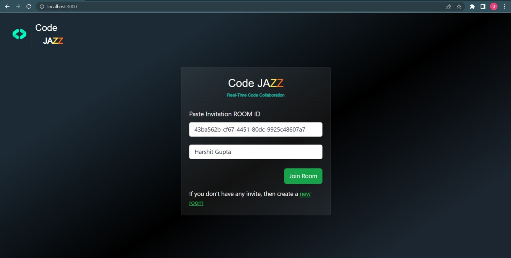
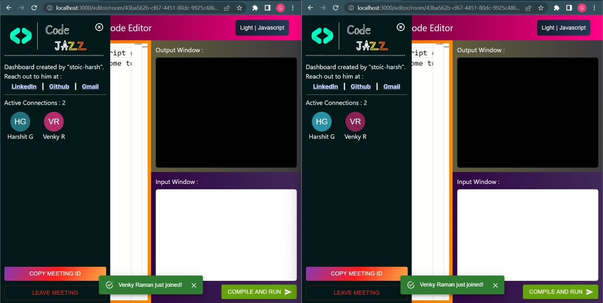
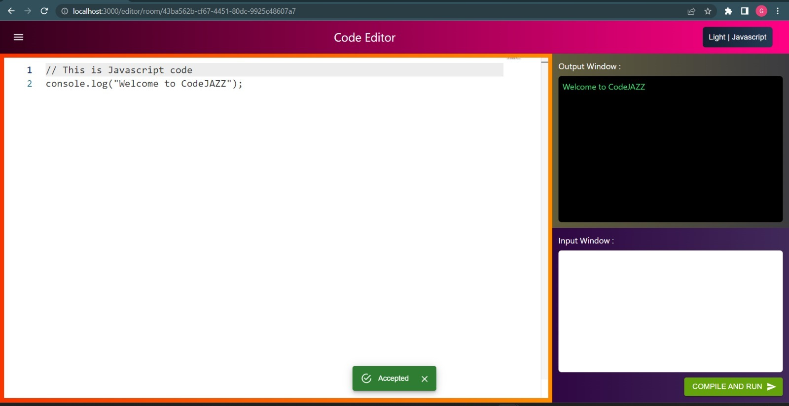
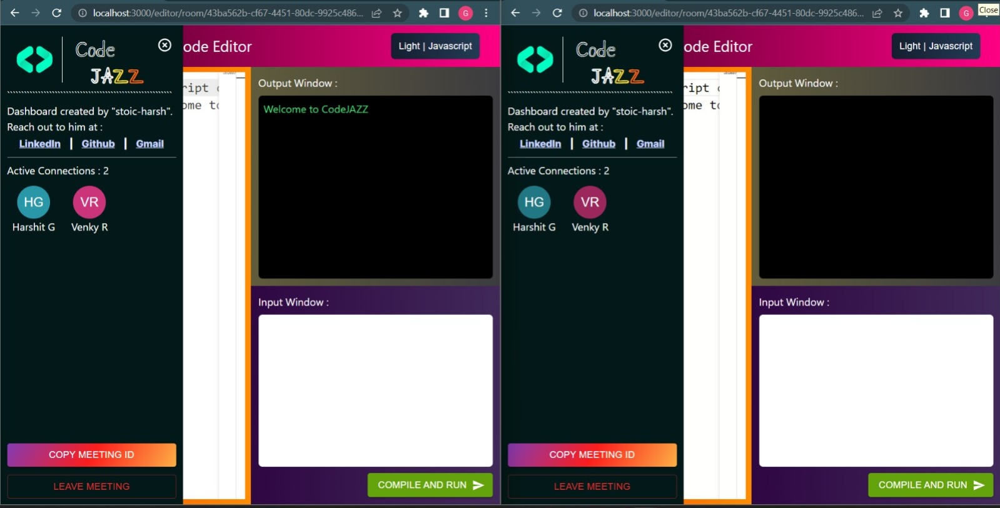
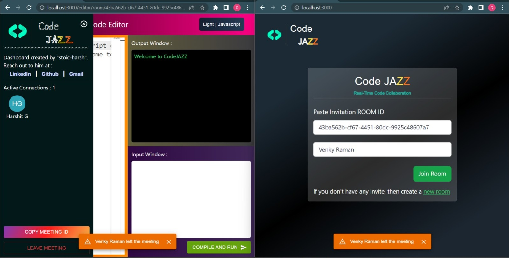

# CodeJAZZ - Jazzing with the code 🎷
CodeJAZZ is a **Real-Time CodeCollab-editor-cum-online-compiler**, a cutting-edge web application that enables multiple users to collaborately code together in real-time within private rooms, and compile and execute the same. It provides a seamless and immersive coding experience, empowering teams to work collaboratively and boost productivity.

# Live Demo
https://code-jazz.vercel.app/

## Use Cases
1. **Remote Collaboration:** Collaborate with team members, colleagues, or students regardless of their physical location. Say goodbye to geographical barriers and enjoy real-time coding sessions.
2. **Online Code Compilation and Execution:** Run your code in 26+ different languages and 50+ themes. 
3. **Hackathons and Workshops:** Host hackathons or conduct workshops where participants can code and brainstorm together, fostering creativity and innovation.
4. **Learning & Teaching:** Facilitate code teaching and learning experiences with real-time feedback and interaction between educators and students.
5. **Code Reviews:** Perform code reviews in real-time, enhancing code quality and reducing turnaround time.
 
## How can you benefit
* Seamless Synchronization across the globe.
* Learn and grow together.
* **Live Execution:** Execute your code directly within the platform and instantly view the output without leaving the editor.
* **Variety of Themes:** Personalize your coding environment with a wide range of themes to suit your taste and reduce eye strain.
* **Extensive Language Support:** Code in your preferred programming language from a vast collection of supported languages.

## Project Significance
* Fast and efficient
* Scalable and secure
* Open-source and customizable
* Innovative Collaboration

## Video Demo
https://github.com/stoic-harsh/CodeJAZZ/assets/137406928/aa919327-3855-4e2f-80a5-e93204804ef4

## Tech/framework used and Pre-requisites
* Next.js
* Material UI
* Tailwindcss
* Monaco Code-Editor
* Judge0 Code-Executioner
* Websockets
* Ably SDK and APIs

## What I learnt
1. Integration of syntax-highlighter and code-editor web components like [CodeMirror](https://codemirror.net/) and [Monaco](https://microsoft.github.io/monaco-editor/).
2. Online code execution systems like [Judge0](https://judge0.com/)
3. Implementing websockets.
4. Implementing real-time functionalities in server-less frameworks like Next.js where websockets don't work.
5. How to use APIs to achieve real-time communication like [Ably](https://ably.com/)

## Screenshots






## Usage
Create a ```.env``` file. Place in your RAPID_API_KEY(for judge0 API) and ABLY_API_KEY_ROOT(for Ably). Hit ***npm run dev*** at root location in terminal to start application in localhost. 
Then, you can play around with frontend components and API calls.

## License
This project is licensed under the **GNU General Public License v3 (GPL-3.0)**.
Read the license carefully.

## Contribute
We welcome contributions from the open-source community. Feel free to submit bug reports, feature requests, or pull requests. Together, let's build a stronger and more collaborative coding ecosystem.

# Let's Collaborate and Code together in real-time
Experience the thrill of collaborative coding with CodeJAZZ.
Join the thrill now!
